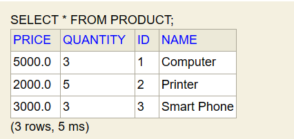
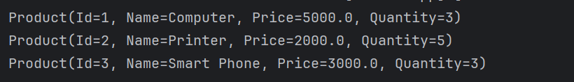
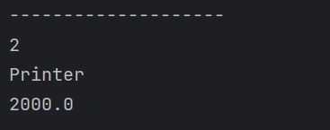
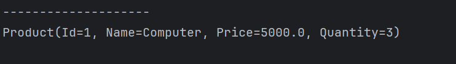
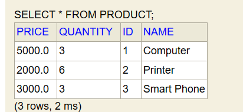
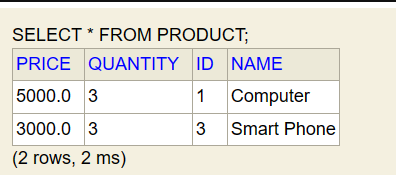
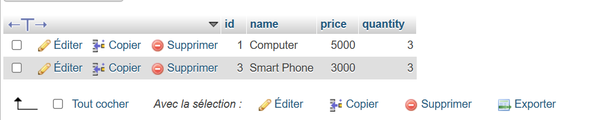
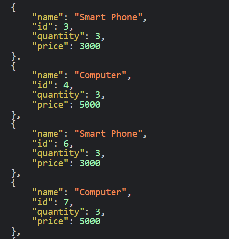

<h2>Compte rendu de l'activité ORM JPA Hibernate Spring Data</h2>

Après la création de l'entité JPA Product et la création de l'interface JPA 
ProductRepository basée sur Spring data 
j'ai réalisé les tests suivants en utilisant H2 :

<h4>Ajouter des produits</h4>

<h4>Consulter tous les produits</h4>

<h4>Consulter un produit à partir de son Id</h4>

<h4>Chercher des produits qui contiennent un mot clé</h4>

<h4>Mettre à jour un produit</h4>

<h4>Supprimer un produit</h4>

<h4>Migration vers MySQL</h4>

Après la reconfiguration du fichier application.properties
la migration vers MySQL a été faite avec succès

<h4>la couche web </h4>

les données sont affichées sous format JSON

